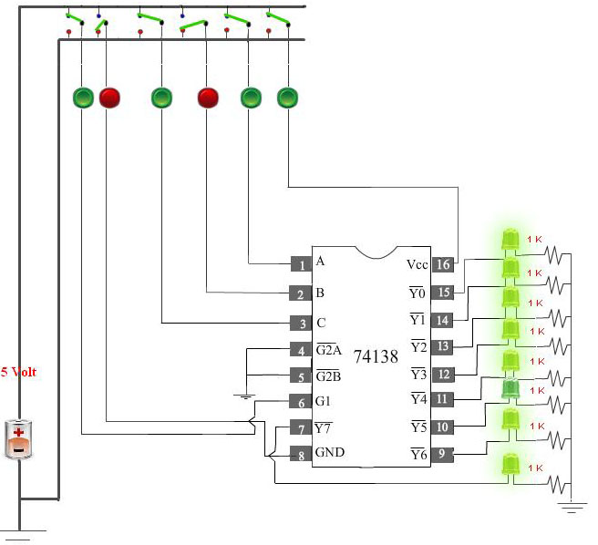
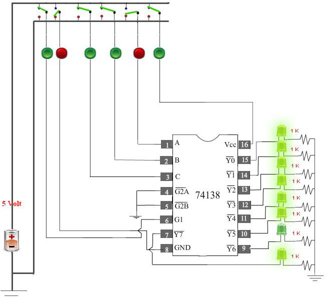
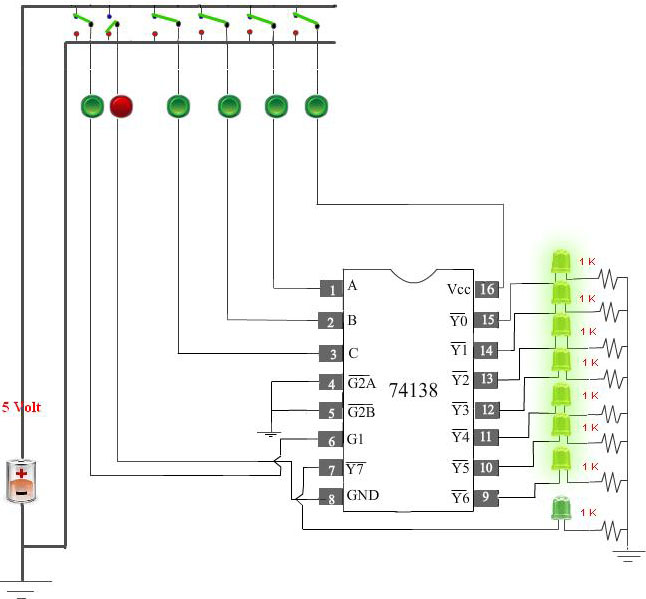

## Procedure

1. Click on the Experiment tab SIMULATORIt will open the workspace

                              
2. See the movie in experiment page by pressing help button ? to understand how the following steps are to be executed.

                                

3. In the workspace click on Browse BlocksBROWSE BLOCKS.to understand how the following steps are to be executed.

4. Drag Sinewave Generator in the left side of the workspace. Click it to parameterize the sinusoidal signal output. Make amplitude = 3V, frequency = 19 Hz, phase=0 angle.

                                

                            
5. Drag Sampling Block in the workplace. Place it after Sinewave Generator to its right. Click it to parameterize. Make sampling frequency =40 Hz. It will show no. of sample as 80 for display. The display is conformed for 2 sec.
                  

                            
6. Drag the scope in the workspace after sampler to its right.
                    

                            
7. For making connection, take the cursor to the node provided in each block where form connection is to be made. Click on it a circle will appear in the background. If pointed properly a yellowish tinge will appear click at that time to enable connection.
                    

                               
8. Connect sinewave generator O/P to I/O of sampler by clicking at both blocks and a link will appear.
            

                              
9. Similarly connect sampler O/P to one of the I/O of scope.
                      

                             
10. Click somewhere in the middle of the link connecting signal generator & sampler. Keep clicking at bends till you connect it to the other input of the scope.
                    

                            
11. Click on the scope, a new window will appear. It shows that the sinusoidal signal as well as sample in red dots.
                    

                               
12. Move the cursor from one sample to another by draging the slider provide along the x-axis and you will find sample values in the boxes at bottom left part of the window. Note the first 15 values in a note book. This 15 values will go as table 1 in your report.
            

                              
13. In this window, you can change parameters like frequency, amplitude and phase angle of sinusoidal signal generator & sampling frequency.
                      

                            
14. Change the sinusoidal signal generator O/P amplitude to 1.5V and note 1st 15 values. This will form Table 2 in your report. In your observation & discussion part of the reporting, you have to compare Table 1 and Table 2.
                  

                            
15. Change sampling frequency to 43 Hz and amplitude of sinusoidal signal generator at 1V. Note first 15 readings to from Table 3. Compare Table 1 and Table 3
                    

                            
16. Make sampling frequency 40Hz, amplitude of sinusoidal signal generator 10V, phase=30. Table 1st reading to from Table 4. Compare Table 1 and Table 4.
                    

                               
17. Under sampling:Change the Sinusoidal signal generator frequency 50Hz, amplitude 1.4V, phase=0. Sampling frequency= 40 Hz. Take 1st 15 readings. This will from Table 5. Compare Table 1 and Table 5.
            

                              
18. Change the Sinusoidal signal generator frequency=30Hz, Amplitude=1V, Phase=0, sampling frequency = 40Hz. Take 15 readings. This will produce Table 6. Compare Table 1 and Table 6
                      

                             
19. Optional: Select sinusoidal signal generator frequency and sampling frequency simultaneously to form more Table, Table 7 and Table 8 which leads to nyquist rate from observation phenomenon.
                    

                            
20. Click on Report Generation button. The reporting window will appear. Here on by clicking Add Table , you can add tables. In each tables, by clicking add row will be able to add row.
                    

                               
21. For each table make a screenshot of your plots by taking print screen and edit in any image editor to upload a image for each table.
            

                              
22. The observation and discussion box, appears at the end. Then click Yes I have finished my Experiment button to submit your report.
                      

23. Note: if at any time during making circuit if you face any problem please use reset button to erase the circuit and draw the circuit freshly.
                      

                             